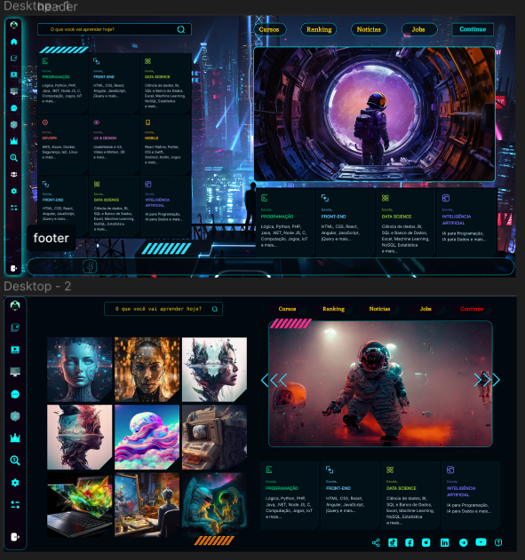

# Design Repository Presentation

Welcome to my design repository! This is the place where I showcase my creative work and share my design projects with the world. Below, you'll find a brief overview of what you can expect to discover in this repository.

## About Me

I am a passionate designer with a love for visual aesthetics and a keen eye for detail. My goal is to create compelling and visually appealing designs that leave a lasting impression.

## Repository Overview

In this repository, you will find a diverse collection of design work, including:

- **Graphic Designs**: Explore a wide range of graphic designs, from logos to posters, that demonstrate my skills in creating captivating visuals.

- **Web Design**: Check out website mockups and UI/UX design concepts that I've crafted to enhance user experiences.

- **Illustrations**: Dive into my world of illustrations, where I express creativity through various art forms and styles.

- **Print Materials**: Discover professionally designed brochures, flyers, and business cards that I've created for various clients.

- **3D Modeling**: Explore my 3D modeling projects, which demonstrate my ability to bring virtual worlds to life.

## Why Explore This Repository?

- Gain design inspiration for your own projects.
- See my growth and development as a designer over time.
- Collaborate on design projects and ideas.
- Reach out for design services and freelance opportunities.

## Get in Touch

If you have any questions, want to collaborate, or need design services, feel free to reach out to me. You can contact me at [kaiquebellmont@gmail.com](mailto:kaiquebellmont@gmail.com).

I'm excited to share my creative journey with you, and I hope you find my work inspiring and engaging. Thank you for visiting my design repository!

